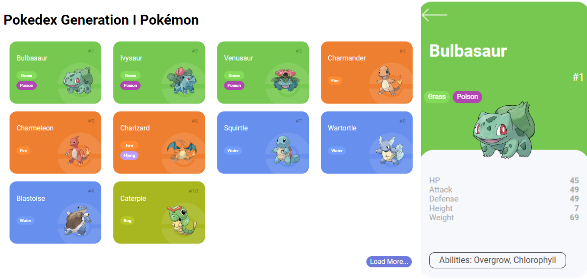

# Trilha JS Developer - Pokedex

### Construindo uma Pokedex com JavaScript 🧑‍💻

O desafio do projeto realizado é criar funcionalidade para visualizar detalhes dos Pokémons, onde o usuário deve clicar em algum Pokémon listado e poder ver os dados específicos dele, listando informações que foram armazenadas através da API: [POKEAPI](https://pokeapi.co/).

Este desafio faz parte do [Curso Javascript Developer](https://www.dio.me/curso-javascript) da DIO, onde foi teve como base esse projeto inicial: [digitalinnovationone/js-developer-pokedex](https://github.com/digitalinnovationone/js-developer-pokedex)

### Tecnologias 💻

### Screenshots 

